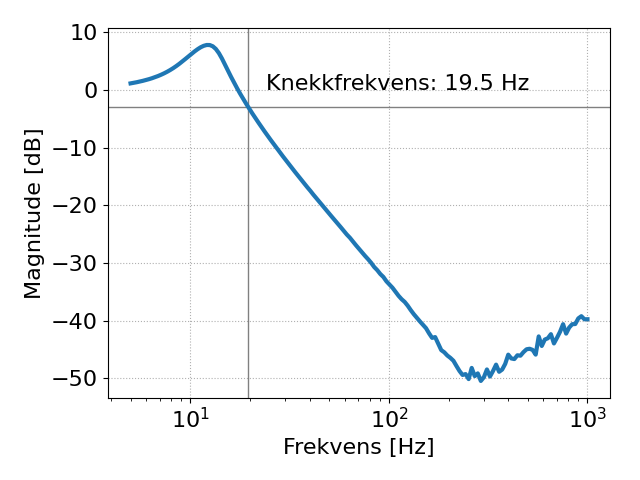

## Lab 1

### 2.1 Forberedelser

-  _Convertion time_ er oppgitt som 12 klokkesykluser. Vi ser også fra figur 1-1 at det tar 3 sykluser fra CS går lav til MSB blir sent på datalinjen. Derfra (inkl. MSB) går det 12 sykluser til all dataen er overført. Det tar altså 15 sykluser å gjøre en sample.
-  Om vi antar at _Vref_ er satt til _Vdd_ så er oppløsningen gitt ved: $$\frac{V_{ref}}{4096} = 0.80 mV.$$
-  Under maximum ratings kan vi se at vi maksimalt kan gå 0.6V under Vss og 0.6V over Vdd.

-  Vi har ikke kontroll over tidsintervallene som kode vi skriver på CPUen på Pien kjører med, fordi CPUen kjører mange tråder og andre programmer samtidig. DMA håndterer innhenting av data fra ADCene for oss. I starten av et program kan vi initialisere DMAen til å sample data fra ADCene med en bestemt samplingsfrekvens. Målepunktene vil så bli lagret i en buffer. Når denne er full kjøres en interupt slik at programmet vårt kan lese av dataen. Imens vi analyserer det første datasettet fylles en annen buffer opp.

### 2.2 Laboppgaver

-  Filteret er et Pi-filter av typen tredjeordens lavpassfilter, og fungerer ved å kombinere kondensatorer og spolers effekt på spenningsignaler som varierer i styrke over tid. Den første kondensatoren $C1$ fungerer som en avkoplingskondensator (decoupling) og kopler AC-signaler til jord. $C1$ skal også ha såpass stor kapasitans at den kan jevne ut en rask endring ift. AC-signaler (ripple). Dermed glatter kondensatoren $C1$ ut signalet. Induktansen $L1$ bidrar til at eventuelle resterende AC-komponenter møter en høy impedans. Sammen med kondensatorene $C2$ og $C3$, som kortslutter AC-komponentene til jord (bypass), får vi et lavpassfilter. Knekkfrekvensen til $LC$-filterert kan beregnes med formelen:

$$\frac{1}{2\pi\sqrt{LC}} = 23 \text{ Hz.}$$

-  $L$ er induktansen til spolen $L1$ i kretsen ($L = L1 = 100 \text{ mH}$), og $C$ er total kapasitans fra kondensatorene $C2$ og $C3$ gitt av formelen $C = C2 + C3 = 470,1 \text{ }\mu\text{F}$. Kondensator C4 vil på grunn av sin relativt lave verdi kunne lade seg ut for ved eventuelle ripples i signalet og fungere som en bypass.

