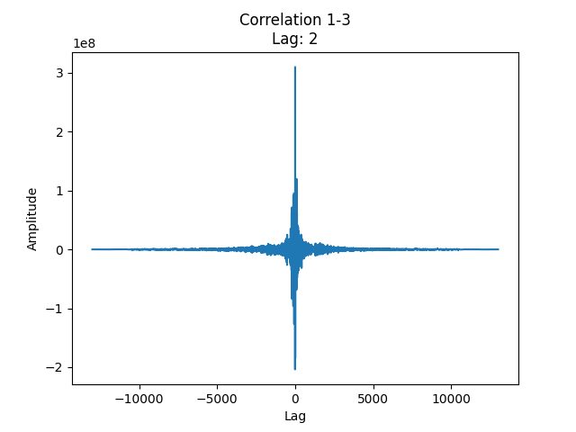

## Lab 2

### 5.1 Forberedelse 1

```py
#
# Fs, signal_1, and signal_2 are defined
#

...

Fs = 50
T = 1 / Fs

samples = 100

n = np.arange(0, samples / Fs, T)
l = np.arange(-samples + 1, samples)

sig_1 = np.sinc(2 * np.pi * n - np.pi)
sig_2 = np.sinc(2 * np.pi * n - 1.2 * np.pi)

correlation = np.correlate(sig_1, sig_2, "full")

# index of max value
max_index = np.argmax(np.abs(correlation))

# find time delay
time_delay = np.abs(l[max_index]) * T
```


### 5.2 forberedelse 2

a) For å beregne maksimal forsinkelse i antall punktprøver mellom to mikrofoner $L_{max}$ stilt opp som i figur $II.4$ i lab-oppgavesettet, med sidelengde $d$ og punktprøvningsfrekvens $f_S$, regner vi ut tiden det tar en planbølge å propagere mellom mikrofonene, ved å dele lengden $d$ på bølgefarta $c$, og gange med punktprøvningsprefkvensen $f_S$ slik at formelen blir:

$$n_{max} =  \frac{d}{c} \cdot f_S$$

b) En formel for estimering av vinkelen til planbølger ii et mikrofon-array som i oppgave 5.2 a) er:

$$\theta = \tan^{-1}{(\sqrt{3}\frac{n_{21}+n_{31}}{n_{21}+n_{31}+n_{32}})}. $$

Jo mindre arrayet er (dvs. kortere $d$), jo mindre er maksimal forsinkelse $n_{max}$, og jo færre mulige verdier kan forsinkelsene $n_{21}\text{, }n_{31}\text{, og }n_{32}$ ha. Dette gjør at antall vinkler som kan estimeres blir færre.

Det er derfor mulig å estimere flere vinkler med en forsinkelse på 4 punktprøver, enn 2 punktprøver.

### 6.1

### 6.2


### 6.3





Formelen for maksimal forsinkelse mellom to mikrofoner i antall punktprøver: $n_{max} = \frac{d}{c} \cdot f_{S}$

| d = 5,5 cm                                                                 | d = 6,3 cm                                                                 | d = 6,4 cm                                                                 | d = 6,5 cm                                                                 |
| -------------------------------------------------------------------------- | -------------------------------------------------------------------------- | -------------------------------------------------------------------------- | -------------------------------------------------------------------------- |
| $n_{max} = \frac{5,5 \text{ cm}}{343,2 \text{ m/s}} \cdot 31250 \text{ Hz}$ | $n_{max} = \frac{6,3 \text{ cm}}{343,2 \text{ m/s}} \cdot 31250 \text{ Hz}$ | $n_{max} = \frac{6,4 \text{ cm}}{343,2 \text{ m/s}} \cdot 31250 \text{ Hz}$ | $n_{max} = \frac{6,5 \text{ cm}}{343,2 \text{ m/s}} \cdot 31250 \text{ Hz}$ |
| $n_{max} = 5,008 \approx 5$                                                 | $n_{max} = 5,736 \approx 6$                                                 | $n_{max} = 5,827 \approx 6$                                                  | $n_{max} = 5,919 \approx 6$                                                 |
